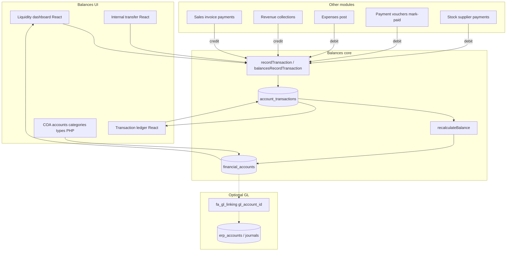
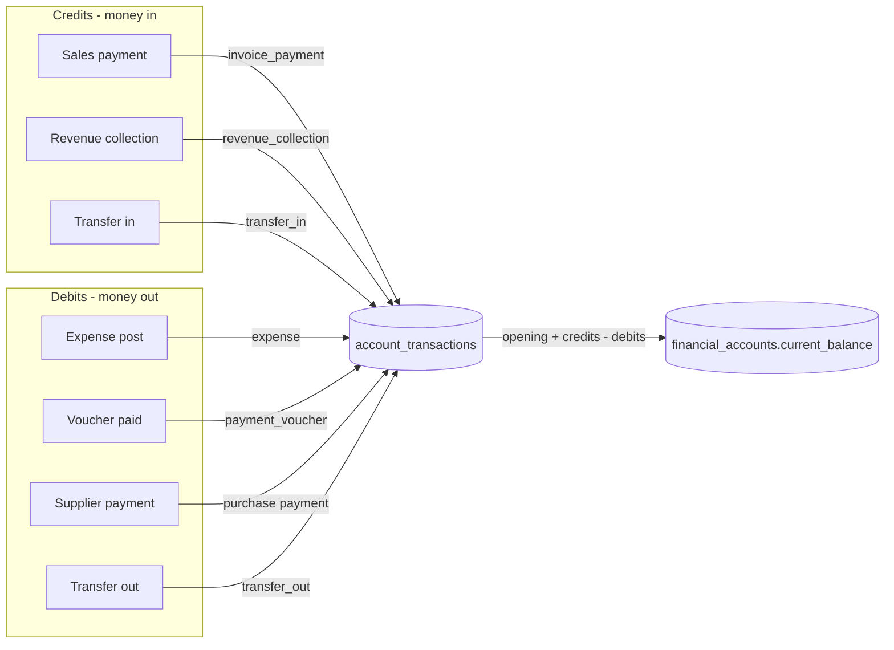
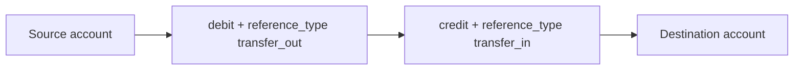

# Balances Module

Operational **cash book** and **chart of accounts** for OmmyERP: track liquidity (cash, bank, mobile), record inflows/outflows on `financial_accounts`, and power the Liquidity dashboard, Transaction ledger, Internal transfer, and COA screens.

Balances is a **PHP + React** module under `modules/balances/`. There is no Laravel `Domains/Balances`. Other modules write the same ledger through `recordTransaction()` / `balancesRecordTransaction()`. Formal P&L / trial balance / balance sheet often use the **journal GL** (`erp_accounts` / `erp_journal_*`), optionally linked via `financial_accounts.gl_account_id`.

---

## How it works in the system



### Money flow (cash-book convention)

In Balances, **credit = money in** (raises `current_balance`) and **debit = money out** (lowers it). This is a cash-book / sub-ledger convention, not full double-entry GL.



### Internal transfer

Moving cash between two accounts posts a **pair** of ledger rows (same amount, opposite sides):



Implemented in `transfer-ui/tf-lib.php` (`tfCreateTransfer`).

---

## Core concepts

| Concept | Meaning |
|---------|---------|
| **Financial account** | Row in `financial_accounts` (cash, bank, mobile, or COA-style type). Optional `parent_id` for hierarchy. |
| **Liquidity bucket** | `balancesAccountLiquidityBucket($type)` maps account types to `cash`, `bank`, or `mobile` for KPIs. |
| **Deposit / payment wallet** | Accounts suitable for receiving or paying cash (`balancesFetchDepositAccounts()`). |
| **Ledger row** | Append-only `account_transactions` with `type` = `credit` \| `debit`, plus `reference_type` / `reference_id`. |
| **Live balance** | `current_balance = opening_balance + ? credits ? ? debits` via `recalculateBalance()`. |
| **COA types / categories** | `financial_account_types`, `financial_account_categories` (reporting structure). |
| **GL link** | Optional `financial_accounts.gl_account_id` ? `erp_accounts` (`includes/fa_gl_linking.php`). |

---

## Directory map

```
modules/balances/
??? README.md
??? functions.php              # schema helpers, COA, recordTransaction, balances
??? config/database.php        # bootstrap + ensure schema
??? includes/                  # guard, header, footer
??? index.php                  # Liquidity dashboard React shell
??? transactions.php           # Transaction ledger React shell
??? transfer.php               # Internal transfer React shell
??? accounts.php / coa_*.php   # Account list + COA create/edit
??? category_*.php / account_type*.php
??? liquidity-dashboard-ui/    # React + ld-lib.php + api/
??? transaction-ledger-ui/     # React + tl-lib.php + api/
??? transfer-ui/               # React + tf-lib.php + api/
```

Partial tenant mirrors may exist under `ultimate/modules/balances/` (liquidity UI); the canonical library remains `modules/balances/`.

---

## Entry URLs

Always keep `?module=balances` so the sidebar stays on Balances.

| Page | Path |
|------|------|
| Liquidity dashboard | `/modules/balances/index.php?module=balances` |
| Transaction ledger | `/modules/balances/transactions.php?module=balances` |
| Internal transfer | `/modules/balances/transfer.php?module=balances` |
| Accounts | `/modules/balances/accounts.php?module=balances` |
| COA create / edit | `coa_create.php`, `coa_edit.php` |
| Categories / types | `account_categories.php`, `account_types.php`, … |

**Local example:**

```
http://localhost/public_html/modules/balances/index.php?module=balances
```

**Company slug:**

```
http://localhost/public_html/{slug}/modules/balances/index.php?module=balances
```

Linked from the Accounting hub card: `erp-laravel/app/Domains/Accounting/Nav.php` ? `modules/balances/index?module=balances`.

**React JSON APIs:**

| UI | Endpoint |
|----|----------|
| Liquidity | `liquidity-dashboard-ui/api/index.php?action=init` |
| Ledger | `transaction-ledger-ui/api/index.php` (`init`, `list`, `ai_search`) |
| Transfer | `transfer-ui/api/index.php` (`init`, `create` POST) |

Build each Vite app with `npm install` && `npm run build` inside the corresponding `*-ui/` folder.

---

## Integrations with other modules

Canonical write path for other modules:

```php
require_once __DIR__ . '/../balances/functions.php'; // adjust relative path

recordTransaction(
    $accountId,
    'credit', // or 'debit'
    $amount,
    $description,
    $refType,  // e.g. invoice_payment, revenue_collection, expense
    $refId,
    $date,     // optional
    $companyId // optional; required when company scope is on
);

// Prefer inside an outer DB transaction:
balancesRecordTransaction($pdo, $accountId, 'debit', $amount, $description, $refType, $refId, $date, $companyId);
```

| Module | How it posts | Typical `reference_type` | Side |
|--------|--------------|--------------------------|------|
| **Sales payments** | `modules/sales/payments/create.php` | `invoice_payment` | credit deposit account |
| **Revenue** | `modules/revenue/includes/revenue-payment-lib.php` (and create/import) | `revenue_collection` / `revenue_entry` | credit |
| **Expenses** | `modules/expenses/includes/balances_integration.php` | `expense` | two debits (payment wallet + expense account) |
| **Payment vouchers** | mark-paid flows | `payment_voucher` | debit pay account |
| **Stock / supplier payments** | finance / stock purchase payment desks | purchase/payment refs | debit bank/cash |
| **Internal transfer** | `transfer-ui` | `transfer_out` / `transfer_in` | debit + credit |
| **Payroll** | no direct Balances call; pays via vouchers when used | — | — |
| **Petty cash / Cash Book** | separate module tables | — | not via `recordTransaction` |

Deposit account pickers use `balancesFetchDepositAccounts()`.

---

## Schema essentials

| Table | Role |
|-------|------|
| **`financial_accounts`** | COA + balances (`opening_balance`, `current_balance`, `type`, `currency`, `status`, optional `company_id`, `parent_id`, `gl_account_id`, …) |
| **`account_transactions`** | Ledger movements (`type` credit/debit, `reference_type`/`reference_id`, `created_by`, optional `company_id`) |
| **`financial_account_types`** | Type catalog + code ranges |
| **`financial_account_categories`** | Reporting categories |
| **`erp_account_categories`**, **`erp_reporting_groups`** | Optional COA metadata |

DDL is ensured by helpers in `functions.php` / `config/database.php` (no `balances_*` prefix for the core ledger).

---

## Balance formula

```
current_balance = opening_balance + SUM(credits) ? SUM(debits)
```

`recalculateBalance($accountId)` recomputes from history and updates `financial_accounts.current_balance`. Prefer this over hand-editing balances after posting transactions.

---

## Access and bootstrap

- Module query: `?module=balances`.
- Pages use Balances guards / React lib access helpers (`ldRequireAccess`, `tlRequireAccess`, `tfRequireAccess`) which require login and finance/admin-style access as configured.
- PDO: `balances_resolve_pdo()` (and related helpers) for tenant-aware DB connections when company scoping is enabled.
- Pass `company_id` into `balancesRecordTransaction()` when posting from company-scoped modules so ledger rows stay in tenant scope.

---

## Troubleshooting

| Symptom | Check |
|---------|--------|
| Liquidity UI blank / 503 | Build `liquidity-dashboard-ui` (`npm run build`). |
| Ledger or Transfer 503 | Build `transaction-ledger-ui` or `transfer-ui`. |
| Payment did not move balance | Confirm `recordTransaction` ran, `reference_type`/`account_id` correct, and `recalculateBalance` succeeded; check PHP error log. |
| Wrong company data | Ensure company slug / `company_id` on request and on ledger inserts. |
| Sidebar wrong module | Keep `module=balances` on Balances links. |
| GL reports disagree with liquidity | Balances is the cash sub-ledger; GL reports may use journals. Check `gl_account_id` linking if both are used. |

---

## Related docs

- Expenses ? Balances: `modules/expenses/README.md`
- Sales payments: `modules/sales/payments/README.md`
- Finance / stock payments: `modules/finance/README.md`
- GL linking: `includes/fa_gl_linking.php`
