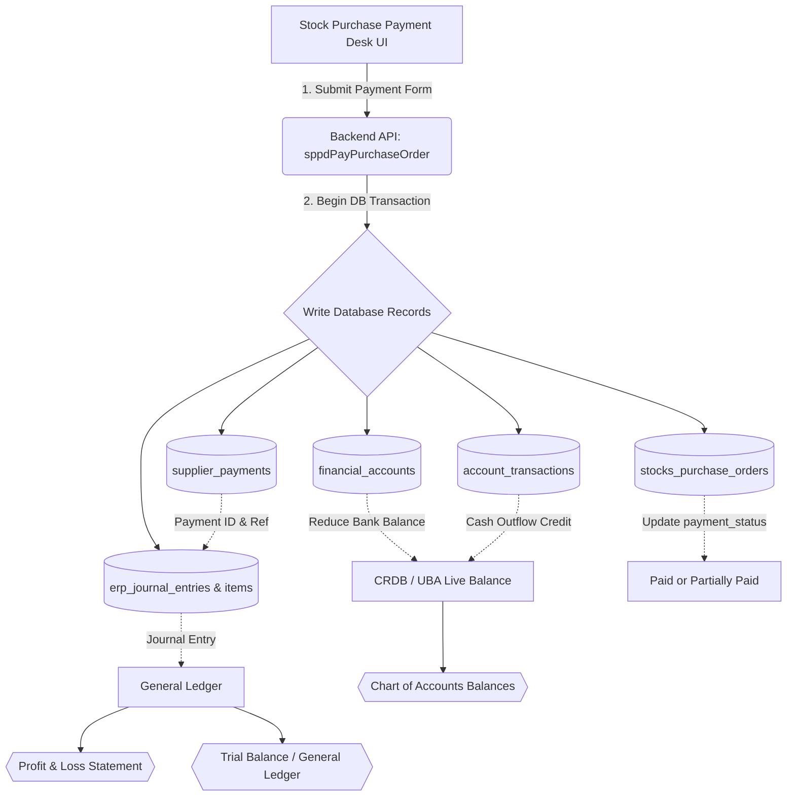

# Stock Purchase Payments, Balances & Financial Reporting Integration

This document explains the unified workflow and technical implementation linking **Purchase Payments**, **Ledger Balances**, and **Financial Reports** inside the ERP system.

---

## 📌 System Architecture & Transaction Flow

The following diagram illustrates how a purchase payment transaction triggers updates across the database, balances, and reports:

---

## 🗄️ Database Tables Involved

| Table Name | Description | Key Fields Written/Modified |
| :--- | :--- | :--- |
| [`supplier_payments`](file:///c:/xampp/htdocs/public_html/modules/finance/stock-purchase-payment-desk-ui/sppd-lib.php#L818) | Stores payment transaction header details. | `payment_number`, `amount`, `payment_method`, `bank_or_cash_account_id`, `journal_entry_id` |
| [`financial_accounts`](file:///c:/xampp/htdocs/public_html/modules/finance/stock-purchase-payment-desk-ui/sppd-lib.php#L815) | Holds bank, cash, and ledger asset balances. | `current_balance` (decreased by payment amount) |
| [`account_transactions`](file:///c:/xampp/htdocs/public_html/modules/finance/stock-purchase-payment-desk-ui/sppd-lib.php#L824) | Cash book transactions ledger. | `type` ('credit' for cash outflow), `amount`, `account_id` (CRDB/UBA) |
| [`stocks_purchase_orders`](file:///c:/xampp/htdocs/public_html/modules/finance/stock-purchase-payment-desk-ui/sppd-lib.php#L812) | Purchase orders registry. | `payment_status` (updated to `'paid'` or `'partially_paid'`) |
| [`erp_journal_entries`](file:///c:/xampp/htdocs/public_html/modules/finance/stock-purchase-payment-desk-ui/sppd-lib.php#L886) | Posted General Ledger entry header. | `entry_number` (format: `JE-YYYY-XXXX`), `status` ('posted') |
| [`erp_journal_items`](file:///c:/xampp/htdocs/public_html/modules/finance/stock-purchase-payment-desk-ui/sppd-lib.php#L900) | Debit and Credit items for the journal entry. | `account_id` (G/L code), `debit`, `credit` |

---

## 🔄 Technical Workflow

### 1. Recording the Payment
When a user pays a purchase order from the [Stock Purchase Payment Desk](file:///c:/xampp/htdocs/public_html/modules/finance/stock-purchase-payment-desk.php):
* The user selects a liquid account (filtered to types: `bank`, `cash`, `mobile`, `asset`).
* The system invokes [`sppdPayPurchaseOrder()`](file:///c:/xampp/htdocs/public_html/modules/finance/stock-purchase-payment-desk-ui/sppd-lib.php#L730) inside a database transaction.
* The bank account balance is reduced and PO payment status updates.

### 2. Double-Entry Accounting Posting
The system automatically creates a posted G/L entry (`erp_journal_entries`) with the following ledger postings:

$$\text{Debit: Accounts Payable (Account 2000)} \quad \text{or} \quad \text{Cost of Purchases (Account 5001)}$$
$$\text{Credit: Bank Account (CRDB / UBA - Account 1001/1002)}$$

* **Example Ledger Entry**:
  * **Debit**: `2000 - Accounts Payable` (reduces company liability) $\rightarrow$ **TZS 5,000,000**
  * **Credit**: `1002 - CRDB` (reduces bank assets) $\rightarrow$ **TZS 5,000,000**

---

## 📊 Financial Reporting Representation

The recorded payment flows dynamically into different sections of your financial statements:

### 1. Profit & Loss Statement (Income Statement)
* **Accrual Accounting (A/P - Account `2000` debited)**:
  * The payment does **not** appear on the P&L at the time of payment because liability settlement is a Balance Sheet event.
  * The purchase value only hits the P&L under **COST OF GOODS SOLD (COGS)** once the corresponding items are sold.
* **Direct Expensing (Cost of Purchases - Account `5001` debited)**:
  * **Smart Analytics P&L** (`modules/analytics/finance.php`): Appears under **COST OF GOODS SOLD (COGS) -> Total COGS** because the report buckets any account containing the word `"purchase"` under COGS.
  * **Basic P&L Report** (`accounting/profit-loss.php`): Appears under **OPERATING EXPENSES** because of the generic name classification rules.

### 2. Balance Sheet
* **Assets**: Cash and Cash Equivalents (Bank Account) decreases by the payment amount.
* **Liabilities**: Accounts Payable decreases by the payment amount.
* *Result*: Assets and liabilities decrease simultaneously, keeping the balance sheet balanced.

### 3. General Ledger & Cash Book Reports
* **Transactions Log**: Viewable at [`modules/balances/transactions.php`](file:///c:/xampp/htdocs/public_html/modules/balances/transactions.php), logging the exact journal entry sequence.
* **Bank Ledger**: Viewable at [`modules/balances/accounts.php`](file:///c:/xampp/htdocs/public_html/modules/balances/accounts.php) by selecting the payment account (e.g. CRDB), showing the cash outflows matching the payment ID.
