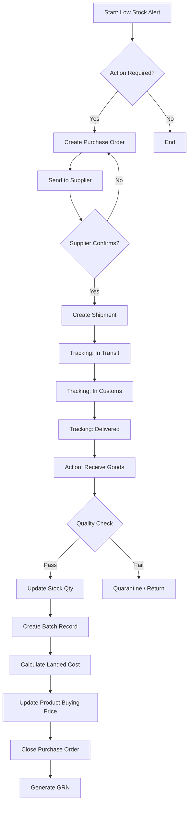

# 🔄 System Workflows

## A. End-to-End Procurement Flow

## B. User Role Permissions Matrix

| Module | Admin | Procurement | Warehouse | Sales | Viewer |
| :--- | :---: | :---: | :---: | :---: | :---: |
| **View Products** | ✅ | ✅ | ✅ | ✅ | ✅ |
| **Create PO** | ✅ | ✅ | ❌ | ❌ | ❌ |
| **Approve PO** | ✅ | ❌ | ❌ | ❌ | ❌ |
| **Receive Goods** | ✅ | ✅ | ✅ | ❌ | ❌ |
| **Update Stock** | ✅ | ✅ | ✅ | ❌ | ❌ |
| **View Costs** | ✅ | ✅ | ❌ | ❌ | ❌ |
| **Reports** | ✅ | ✅ | ❌ | ❌ | ❌ |

## C. Status Lifecycles

### 1. Purchase Orders
*   **Pending**: Draft created, waiting for approval/sending.
*   **Approved**: Authorized by management.
*   **Ordered**: Sent to supplier.
*   **Received**: Goods have arrived (fully or partially).
*   **Cancelled**: Terminated before receipt.

### 2. Shipments
*   **Pending**: Shipment record created.
*   **Confirmed**: Booking confirmed by forwarder.
*   **In Transit**: Departed origin port (ETD passed).
*   **Arrived at Port**: Arrived at destination port (ETA passed).
*   **In Customs**: Undergoing clearance.
*   **Delivered**: Arrived at warehouse, ready for receiving.

## D. Automation Rules

| Trigger | System Action | Requires Manual |
| :--- | :--- | :--- |
| **Stock ≤ Reorder Level** | Show "Restock Warning" on Dashboard | User clicks "Create PO" |
| **Shipment "Delivered"** | Enable "Receive Goods" button | User verifies Qty & Quality |
| **Goods Received** | 1. Increase Stock Qty 2. Create Batch 3. Close PO | none |
| **Landed Cost Entry** | 1. Calculate Unit Cost 2. Update Product Master Price | User clicks "Calculate & Save" |
